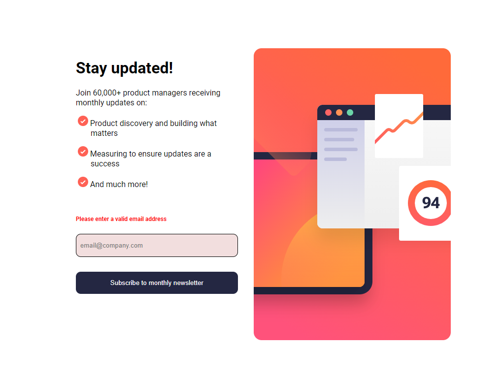
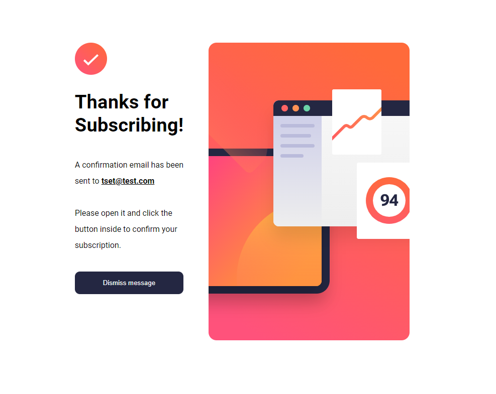
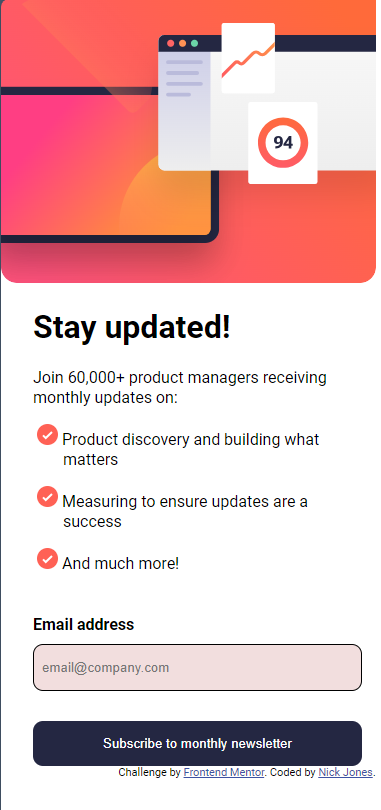

# Frontend Mentor - Newsletter sign-up form with success message solution

This is a solution to the [Newsletter sign-up form with success message challenge on Frontend Mentor](https://www.frontendmentor.io/challenges/newsletter-signup-form-with-success-message-3FC1AZbNrv). Frontend Mentor challenges help you improve your coding skills by building realistic projects. 

## Table of contents

- [Overview](#overview)
  - [The challenge](#the-challenge)
  - [Screenshot](#screenshot)
  - [Links](#links)
- [My process](#my-process)
  - [Built with](#built-with)
  - [What I learned](#what-i-learned)
- [Author](#author)

## Overview

### The challenge

Users should be able to:

- Add their email and submit the form
- See a success message with their email after successfully submitting the form
- See form validation messages if:
  - The field is left empty
  - The email address is not formatted correctly
- View the optimal layout for the interface depending on their device's screen size
- See hover and focus states for all interactive elements on the page

### Screenshot







### Links

- Solution URL: [Add solution URL here](https://your-solution-url.com)
- Live Site URL: [Add live site URL here](https://your-live-site-url.com)

## My process

### Built with

- Semantic HTML5 markup
- CSS custom properties
- Flexbox
- CSS Grid
- Mobile-first workflow


### What I learned

The big take away from this one was using failstates and generating the display text. I am proud that I was able to do most of it without needing to look online too much and used what I already know. I also learned that you can use the <picture> to swap images based on viewport size which I thought was pretty sweet. It was fun to figure out how I can use flexbox and grid together to acheive the layout I was looking for too.

To see how you can add code snippets, see below:

```html
<picture class="form-img">
    <source media="(min-width: 500px)" srcset="/assets/images/illustration-sign-up-desktop.svg">
      
  </picture>
```
```css
.success-message {
    display: flex;
    flex-direction: column;
    max-width: 375px;
    margin: 50px 25px;
  
    @media (min-width: 500px) {
        max-width: 800px; /* Increase max-width for larger screens */
        margin: 0 50px 0 auto;
        font-size: 1.2rem; /* Increase font size for larger screens */
    }
  }
```
```js
function isValidEmail(email) {
    // Check if the email is a string
    if (typeof email !== 'string') {
      return false;
    }
  
    // Check for the presence of an @ symbol
    if (!email.includes('@')) {
      return false;
    }
  
    // Split the email into local part and domain
    const [localPart, domain] = email.split('@');
  
    // Check the local part
    if (!localPart.match(/^[a-zA-Z0-9._-]+$/)) {
      return false;
    }
  
    // Check the domain
    if (!domain.match(/^[a-zA-Z0-9.-]+\.[a-zA-Z]{2,}$/)) {
      return false;
    }
    // Check if email has a value
    if (!email) {
        return false;
    }
  
    // If all checks pass, the email is valid
    return true;
  }
```
## Author

- Frontend Mentor - [@TheMightyLoafer](https://www.frontendmentor.io/profile/TheMightyLoafer)
- GitHub - [TheMightyLoafer](https://github.com/TheMightyLoafer)

